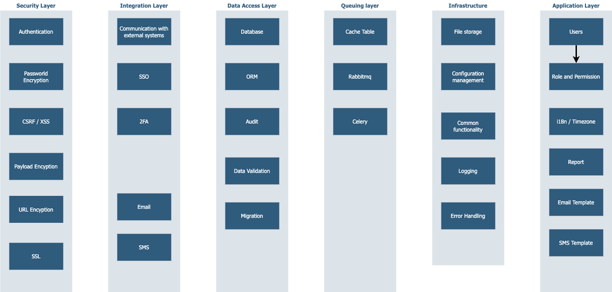

## Security Layer
1. [Authentication](Mdfiles/SecurityLayer/Authentication.md)
2. [Passworld Encryption](Mdfiles/SecurityLayer/PassworldEncryption.md)
3. [CSRF / XSS ](Mdfiles/SecurityLayer/CSRF_XSS.md)
4. [Payload Encyption](Mdfiles/SecurityLayer/PayloadEncyption.md)
5. [URL Encyption](Mdfiles/SecurityLayer/URLEncyption.md)
6. [SSL](Mdfiles/SecurityLayer/SSL.md)

## Integration Layer
1. [Communication with external systems](Mdfiles/IntegrationLayer/3rdPartyAPI.md)
2. [SSO](Mdfiles/IntegrationLayer/SSO.md)
3. [2FA](Mdfiles/IntegrationLayer/2FA.md)
4. [Email](Mdfiles/IntegrationLayer/Email.md)
5. [SMS](Mdfiles/IntegrationLayer/SMS.md)

## Data Access Layer
1. [Database](Mdfiles/DataAccessLayer/Database.md)
2. [ORM](Mdfiles/DataAccessLayer/ORM.md)
3. [Audit](Mdfiles/DataAccessLayer/Audit.md)
4. [Data Validation](Mdfiles/DataAccessLayer/DataValidation.md)
5. [Migration](Mdfiles/DataAccessLayer/Migration.md)

## Queuing Layer
1. [Cache Table](Mdfiles/QueuingLayer/CeleryCacheTable.md)
2. [Message Queuing Service](Mdfiles/Queuinglayer/CelerySettings.md)
3. [Celery](Mdfiles/QueuingLayer/Celery.md)
4. [Task](Mdfiles/QueuingLayer/CeleryTask.md)

## Infrastructure
1. [Logging](Mdfiles/Infrastructure/Logging.md)
2. [File Storage](Mdfiles/Infrastructure/FileStorage.md)
3. [Configuration Management](Mdfiles/Infrastructure/Logging.md)
4. [Common Functionality](Mdfiles/Infrastructure/CommonFunctionality.md)
5. [Error Handling](Mdfiles/Infrastructure/ErrorHandling.md)

## Application
1. [Users](Mdfiles/ApplicationLayer/Users.md)
2. [Role and Permission](Mdfiles/ApplicationLayer/RolePermission.md)
3. [i18n](Mdfiles/ApplicationLayer/i18n.md)
4. [Timezone](Mdfiles/ApplicationLayer/Timezone.md)
5. [Performance testing tool](Mdfiles/ApplicationLayer/Report.md)
6. [SMS Template](Mdfiles/ApplicationLayer/SMSTemplate.md)
7. [Email Template](Mdfiles/ApplicationLayer/EmailTemplate.md)