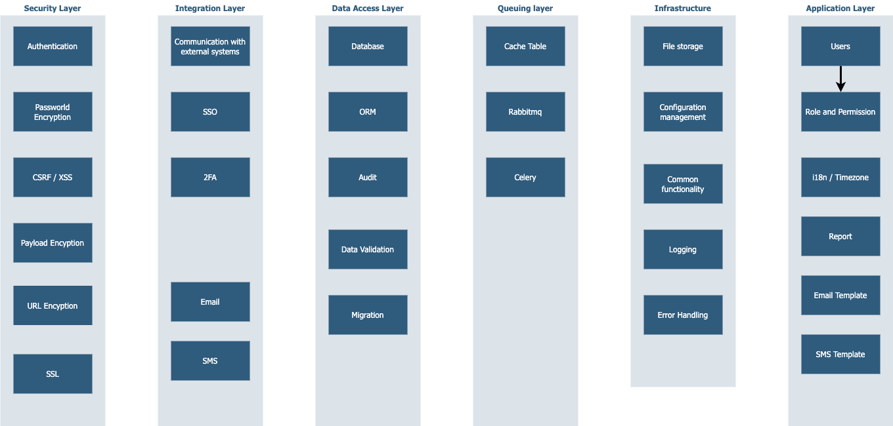

## Security Layer
[Authentication](Mdfiles/Infrastructure/Logging.md)
[Passworld Encryption](Mdfiles/Infrastructure/FileStorage.md)
[CSRF / XSS ](Mdfiles/Infrastructure/ConfigurationManagement.md)
[Payload Encyption](Mdfiles/Infrastructure/ConfigurationManagement.md)
[URL Encyption](Mdfiles/Infrastructure/ConfigurationManagement.md)
[SSL](Mdfiles/Infrastructure/ConfigurationManagement.md)

## Integration Layer
[Communication with external systems](Mdfiles/Infrastructure/ConfigurationManagement.md)
[SSO](Mdfiles/Infrastructure/ConfigurationManagement.md)
[2FA](Mdfiles/Infrastructure/ConfigurationManagement.md)
[Email](Mdfiles/Infrastructure/ConfigurationManagement.md)
[SMS](Mdfiles/Infrastructure/ConfigurationManagement.md)

## Data Access Layer
[Database](Mdfiles/Infrastructure/ConfigurationManagement.md)
[ORM](Mdfiles/Infrastructure/ConfigurationManagement.md)
[Audit](Mdfiles/Infrastructure/ConfigurationManagement.md)
[Data Validation](Mdfiles/Infrastructure/ConfigurationManagement.md)
[Migration](Mdfiles/Infrastructure/ConfigurationManagement.md)

## Queuing Layer
[Cache Table](Mdfiles/Infrastructure/ConfigurationManagement.md)
[Rabbitmq](Mdfiles/Infrastructure/ConfigurationManagement.md)
[Celery](Mdfiles/Infrastructure/ConfigurationManagement.md)

## Infrastructure
[Logging](Mdfiles/Infrastructure/Logging.md)
[File Storage](Mdfiles/Infrastructure/FileStorage.md)
[Configuration Management](Mdfiles/Infrastructure/ConfigurationManagement.md)

## Application
[Users](Mdfiles/Infrastructure/Logging.md)
[Role and Permission](Mdfiles/Infrastructure/Logging.md)
[i18n](Mdfiles/Infrastructure/Logging.md)
[Timezone](Mdfiles/Infrastructure/Logging.md)
[Report](Mdfiles/Infrastructure/Logging.md)
[SMS Template](Mdfiles/Infrastructure/Logging.md)
[Email Template](Mdfiles/Infrastructure/Logging.md)

